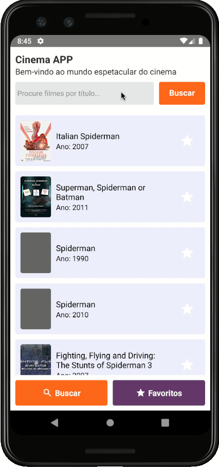

# Desafio Alfred: Novembro/2020 

Neste desafio você terá que implementar um sistema mobile com React Native onde será possível buscar por filmes e series utilizando a API (http://www.omdbapi.com/). A sua solução deve:

- Permitir a busca por filmes
- Listar os filmes encontrados
- Permitir escolher filmes favoritos
- Permitir remover um filme dos favoritos
- Listar os filmes favoritos
- Caso o aplicativo seja fechado, os favoritos não devem ser perdidos

Para ajudar na concepção do layout, estamos disponibilizando abaixo um print de um aplicativo que atende os requisitos listados. Use sua criatividade para criar um layout novo, ou reproduza o leyout proposto, se preferir.

Para facilitar um pouco mais as coisas, já deixamos separada uma chave de acesso para a API (ou você pode criar a sua também):

  

Chave de API: 925eba28
Exemplo requisição: GET http://www.omdbapi.com/?apikey=925eba28&s=batman

Você pode criar uma aplicação nativa, ou com expo (sdk39+).

## Entrega da sua solução
Altere o arquivo README.md descrevendo o que o aplicativo faz e que tipo de premissas foram adotadas para desenvolver as funcionalidades. Adicione pelo menos uma imagem do aplicativo, pode ser uma imagem estática ou um gif do aplicativo sendo utilizado. Para entregar o projeto, faça um fork neste repositório e envie o link do seu repositório para o responsável quando o projeto estiver finalizado.

Ficamos no aguardo da entrega da sua solução e desejamos boa sorte ;)
